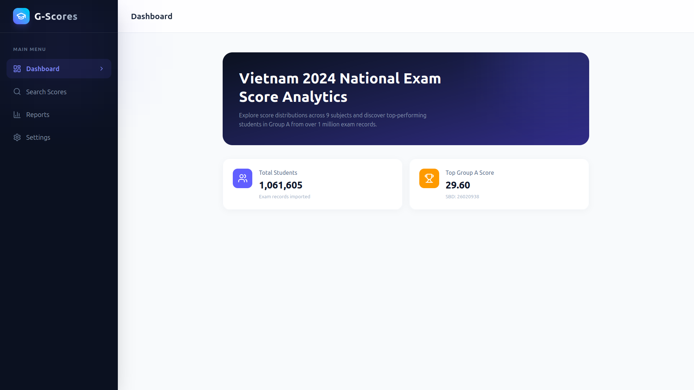
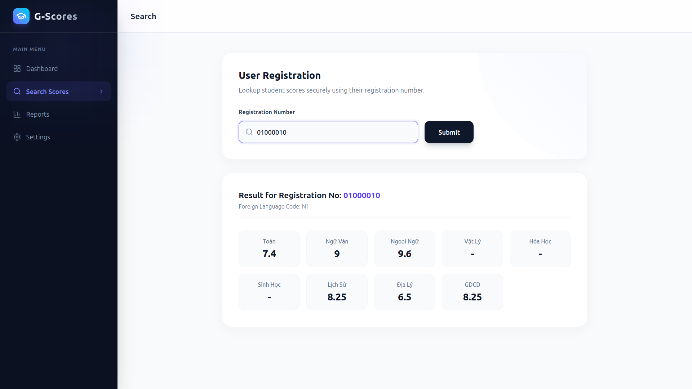
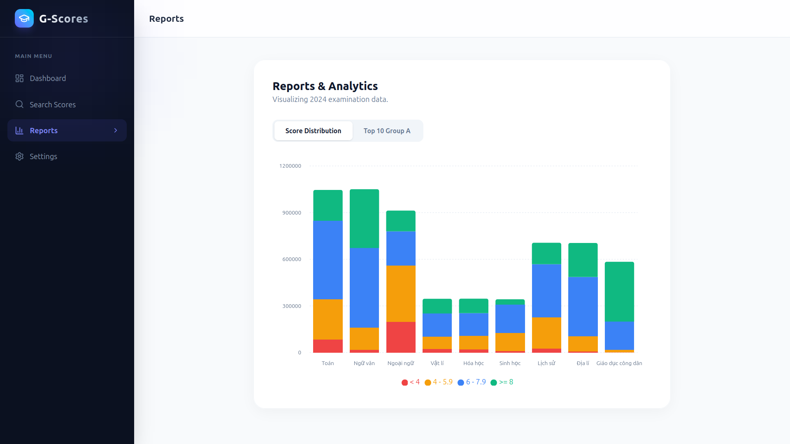
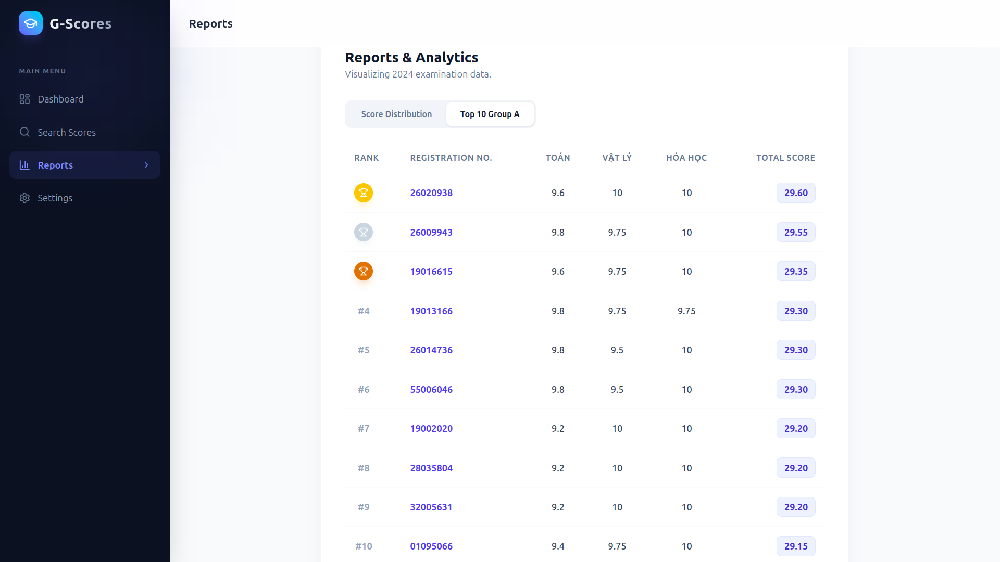
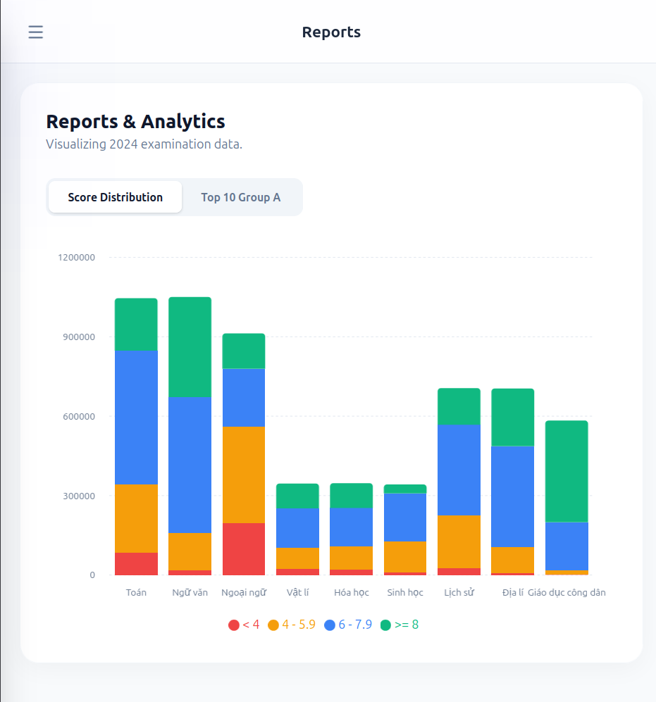
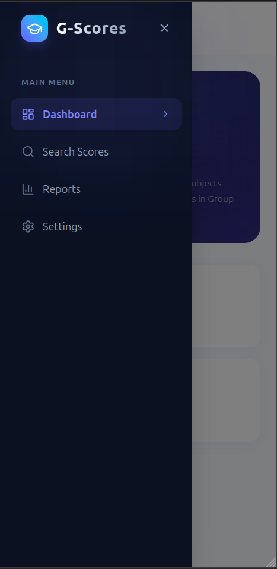
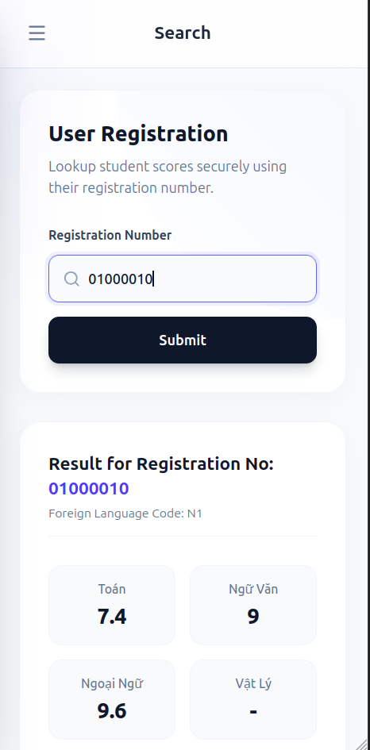
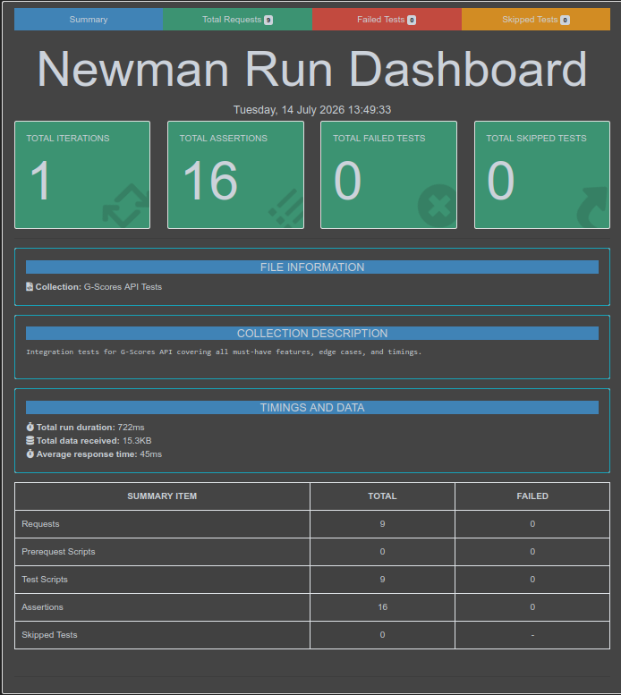
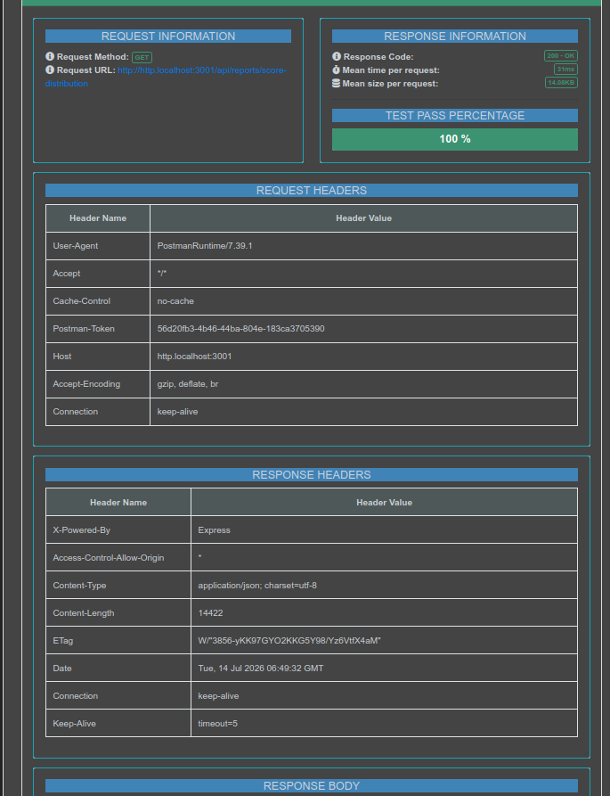

# G-Scores

A full-stack web application to look up and visualize 2024 National High School Examination (THPT) scores in Vietnam.

Check out the live application here: **[g-scores-2024.vercel.app](https://g-scores-2024.vercel.app/)**

> **NOTE FOR REVIEWERS REGARDING DATASET:**  
> To provide the fastest and most reliable evaluation experience, the 41MB raw CSV dataset (`diem_thi_thpt_2024.csv`) has been intentionally committed into the repository at `backend/src/seeds/dataset/`. This ensures that you can spin up the entire application (including database seeding) in one click without needing to download external files, configure paths, or encounter network timeouts.

## Screenshots

### Web Dashboard & Analytics

| Dashboard                                                  | Search Scores                                    |
| ---------------------------------------------------------- | ------------------------------------------------ |
|                    |  |
| **Score Distribution**                                     | **Top 10 Group A**                               |
|  |  |

### Responsive Design (Tablet & Mobile)

| iPad View                      | Mobile Navigation                      | Mobile View                            |
| ------------------------------ | -------------------------------------- | -------------------------------------- |
|  |  |  |

## Tech Stack

| Layer      | Technology                                                    |
| ---------- | ------------------------------------------------------------- |
| Frontend   | React 19, TypeScript, Vite, Tailwind CSS v4, Recharts, Lucide |
| Backend    | Node.js, Express, TypeScript                                  |
| Database   | MongoDB, Mongoose                                             |
| Validation | Zod                                                           |
| Testing    | Postman, Newman (Automated HTML Reports)                      |
| DevOps     | Docker, Docker Compose, Nginx                                 |

## Project Structure

```
g-scores/
├── backend/       # Express + TypeScript API (Port 3001)
├── frontend/      # React + Vite application (Port 5173)
├── testing/       # Postman collection & Newman automated test reports
└── docker-compose.yml
```

## Quick Start (Recommended)

The easiest way to run the application is using Docker. This will automatically start the Database, run the seeder, generate report caches, and serve the Frontend and Backend.

```bash
docker compose up --build -d
```

- **Frontend:** [http://localhost:8080](http://localhost:8080)
- **Backend API:** [http://localhost:3001](http://localhost:3001)

_(Note: The first startup might take a few moments as it parses and imports ~1 million records from the CSV into MongoDB. Subsequent startups will skip this step via idempotency checks)._

**Resetting the Environment:**
To completely stop the application and wipe the database (e.g., to test the initial seeding process again), run:

```bash
docker compose down -v
```

---

## Manual Setup (Local Development)

If you prefer to run the application without Docker:

### 1. Database

Ensure you have MongoDB running locally on `mongodb://localhost:27017/g-scores` (or configure a custom URI in `backend/.env`).

### 2. Backend

```bash
cd backend
npm install
npm run seed              # Import CSV data into MongoDB (run once)
npm run generate-reports  # Pre-compute and cache report data (run once)
npm run dev               # Start development server on port 3001
```

### 3. Frontend

```bash
cd frontend
npm install
npm run dev               # Start development server on port 5173
```

## Automated API Testing

This project includes a comprehensive API testing suite covering all endpoints, edge cases, and response times.

To run the tests manually:

```bash
cd testing
npm install
npx newman run g-scores.postman_collection.json -r cli,htmlextra
```

_You can view the latest test results by opening `testing/newman-report.html` in your browser._

| Overall Summary                                  | Detailed Endpoints                                     |
| ------------------------------------------------ | ------------------------------------------------------ |
|  |  |

## API Endpoints

| Method | Endpoint                          | Description                                                                 |
| ------ | --------------------------------- | --------------------------------------------------------------------------- |
| GET    | `/api/health`                     | API Healthcheck                                                             |
| GET    | `/api/scores/:sbd`                | Look up score by 8-digit registration number                                |
| GET    | `/api/reports/score-distribution` | Get score distribution for all 9 subjects *(O(1) Cached from >1M records — avg 31ms)*  |
| GET    | `/api/reports/top-group-a`        | Get Top 10 highest scorers in Group A *(O(1) Cached from >1M records — avg 23ms)*      |
| GET    | `/api/reports/stats`              | Get total students & highest score summary *(O(1) Cached from >1M records — avg 22ms)* |
